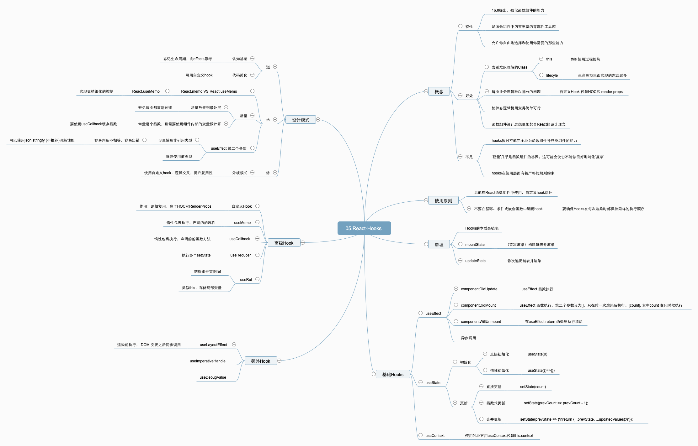

<br/>

<br/>

## Hooks的设计动机

### Hooks 出现的背景

- 类组件的不足
    - 状态逻辑复用难
        - 缺少复用机制
        - 渲染属性和高阶组件导致层级冗余
    - 趋向复杂难以维护
        - 生命周期函数混杂不相干逻辑
        - 相干逻辑分散在不同生命周期
    - this 指向困扰
        - 内联函数过度创建新句柄
        - 类成员函数不能保证 this

- 函数组件更加契合 React 框架的设计理念

React 组件本身的定位就是函数，一个吃进数据、吐出 UI 的函数。作为开发者，我们编写的是声明式的代码，而 React 框架的主要工作，就是及时地把声明式的代码转换为命令式的 DOM 操作，把数据层面的描述映射到用户可见的 UI 变化中去。这就意味着从原则上来讲，React 的数据应该总是紧紧地和渲染绑定在一起的，而类组件做不到这一点。

### Hooks 的主要作用

- React-Hooks 的出现，就是为了帮助函数组件补齐这些（相对于类组件来说）缺失的能力。

- Hooks 的本质：一套能够使函数组件更强大、更灵活的“钩子”

如果说函数组件是一台轻巧的快艇，那么 React-Hooks 就是一个内容丰富的零部件箱。“重装战舰”所预置的那些设备，这个箱子里基本全都有，同时它还不强制你全都要，而是允许你自由地选择和使用你需要的那些能力，然后将这些能力以 Hook（钩子）的形式“钩”进你的组件里，从而定制出一个最适合你的“专属战舰

- 优化类组件的三大问题
    - 函数组件无 this 问题
    - 自定义 Hook 方便复用状态逻辑
    - 副作用的关注点分离

## Hooks心智模型

- 首先用 Hooks 开发需要抛弃生命周期的思考模式，以 effects 的角度重新思考

过去类组件的开发模式中，在 componentDidMount 中放置一个监听事件，还需要考虑在 componentWillUnmount 中取消监听，甚至可能由于部分值变化，还需要在其他生命周期函数中对监听事件做特殊处理。在 Hooks 的设计思路中，可以将这一系列监听与取消监听放置在一个 useEffect 中，useEffect 可以不关心组件的生命周期，只需要关心外部依赖的变化即可，对于开发心智而言是极大的减负。这是 Hooks 的设计根本

- 符合外观模式设计思想

么就设计模式而言，还需要顾及 Hooks 的组合问题。在这里，我的实践经验是采用外观模式，将业务逻辑封装到各自的自定义 Hook 中。比如用户信息等操作，就把获取用户、增加用户、删除用户等操作封装到一个 Hook 中。而组件内部是抽空的，不放任何具体的业务逻辑，它只需要去调用单个自定义 Hook 暴露的接口就行了，这样也非常利于测试关键路径下的业务逻辑

### Hooks 核心特点

1. 告别难以理解的 Class：把握 Class 的两大“痛点：this和生命周期”

坊间总有传言说 Class 是“难以理解”的，这个说法的背后是 this 和生命周期这两个痛点。

2. 满足关注点分离特点，更好的实现逻辑拆分，代码组织更清晰

在过去，你是怎么组织自己的业务逻辑的呢？我想多数情况下应该都是先想清楚业务的需要是什么样的，然后将对应的业务逻辑拆到不同的生命周期函数里去——没错，逻辑曾经一度与生命周期耦合在一起。

3. 状态复用：Hooks 将复杂的问题变简单

过去我们复用状态逻辑，靠的是 HOC（高阶组件）和 Render Props 这些组件设计模式，这是因为 React 在原生层面并没有为我们提供相关的途径。但这些设计模式并非万能，它们在实现逻辑复用的同时，也破坏着组件的结构，其中一个最常见的问题就是“嵌套地狱”现象。

Hooks 可以视作是 React 为解决状态逻辑复用这个问题所提供的一个原生途径。现在我们可以通过自定义 Hook，达到既不破坏组件结构、又能够实现逻辑复用的效果。

要理解上面这两段话，需要你对组件设计模式有基本的理解和应用。如果你读下来觉得一头雾水，也不必心慌。对于组件状态复用这个问题（包括 HOC、Render Props 和自定义 Hook），现在我对你的预期是“知道有这回事就可以了”。如果你实在着急，可以先通过文档中的相关内容简单了解一下。在专栏的第三模块，我会专门把这块知识提出来，放在一个更合适的上下文里给你掰开来讲。

### 保持清醒：Hooks 并非万能

尽管我们已经说了这么多 Hooks 的“好话”，尽管 React 团队已经用脚投票表明了对函数组件的积极态度，但我们还是要谨记这样一个基本的认知常识：事事无绝对，凡事皆有两面性。更何况 React 仅仅是推崇函数组件，并没有“拉踩”类组件，甚至还官宣了“类组件和函数组件将继续共存”这件事情。这些都在提醒我们，在认识到 Hooks 带来的利好的同时，还需要认识到它的局限性。

关于 Hooks 的局限性，目前社区鲜少有人讨论。这里我想结合团队开发过程当中遇到的一些瓶颈，和你分享实践中的几点感受：

- Hooks 暂时还不能完全地为函数组件补齐类组件的能力：比如 getSnapshotBeforeUpdate、componentDidCatch 这些生命周期，目前都还是强依赖类组件的。官方虽然立了“会尽早把它们加进来”的 Flag，但是说真的，这个 Flag 真的立了蛮久了……（扶额）

- “轻量”几乎是函数组件的基因，这可能会使它不能够很好地消化“复杂”：我们有时会在类组件中见到一些方法非常繁多的实例，如果用函数组件来解决相同的问题，业务逻辑的拆分和组织会是一个很大的挑战。我个人的感觉是，从头到尾都在“过于复杂”和“过度拆分”之间摇摆不定，哈哈。耦合和内聚的边界，有时候真的很难把握，函数组件给了我们一定程度的自由，却也对开发者的水平提出了更高的要求。

- Hooks 在使用层面有着严格的规则约束：这也是我们下个课时要重点讲的内容。对于如今的 React 开发者来说，如果不能牢记并践行 Hooks 的使用原则，如果对 Hooks 的关键原理没有扎实的把握，很容易把自己的 React 项目搞成大型车祸现场。

## Hooks使用技巧

1. React.memo vs React.useMemo

- React.memo 是一个高阶组件，它的效果类似于 React.pureComponent

- React.useMemo 可以实现更精细化的控制,可以通过分拆组件的方式阻断重渲染

```js
function Banner() {
  let appContext = useContext(AppContext);
  let theme = appContext.theme;
  return React.useMemo(() => {
    return <Slider theme={theme} />;
  }, [theme])
}
export default React.memo(Banner)

```

2. 常量和函数

- 由于函数组件每次渲染时都会重新执行，所以常量应该放置到函数外部去，避免每次都重新创建。

- 而如果定义的常量是一个函数，且需要使用组件内部的变量做计算，那么一定要使用 useCallback 缓存函数。

3. useEffect 第二个参数的判断问题

- uesEffect不要用引用类型

在设计上它同样是进行浅比较，如果传入的是引用类型，那么很容易会判定不相等，所以尽量不要使用引用类型作为判断条件，很容易出错。


## Hooks的分类

### 基础Hooks

- useEffect

副作用钩子。可模拟类组件生命周期；它接收两个参数， 第一个是进行的异步操作， 第二个是数组，用来给出Effect的依赖项。

- useState

状态钩子。为函数组建提供内部状态

- useContext

共享钩子。该钩子的作用是，在组件之间共享状态。可以解决react逐层通过Porps传递数据，它接受React.createContext()的返回结果作为参数，使用useContext将不再需要Provider 和 Consumer。

### 高级Hooks

- useMemo

```js
const memoizedValue = useMemo(() => computeExpensiveValue(a, b), [a, b]);
```

返回一个 memoized 值。

把“创建”函数和依赖项数组作为参数传入 useMemo，它仅会在某个依赖项改变时才重新计算 memoized 值。这种优化有助于避免在每次渲染时都进行高开销的计算。

记住，传入 useMemo 的函数会在渲染期间执行。请不要在这个函数内部执行与渲染无关的操作，诸如副作用这类的操作属于 useEffect 的适用范畴，而不是 useMemo。

如果没有提供依赖项数组，useMemo 在每次渲染时都会计算新的值。

你可以把 useMemo 作为性能优化的手段，但不要把它当成语义上的保证。将来，React 可能会选择“遗忘”以前的一些 memoized 值，并在下次渲染时重新计算它们，比如为离屏组件释放内存。先编写在没有 useMemo 的情况下也可以执行的代码 —— 之后再在你的代码中添加 useMemo，以达到优化性能的目的。

- useCallback

```js
const memoizedCallback = useCallback(
  () => {
    doSomething(a, b);
  },
  [a, b],
);
```

返回一个 memoized 回调函数。

把内联回调函数及依赖项数组作为参数传入 useCallback，它将返回该回调函数的 memoized 版本，该回调函数仅在某个依赖项改变时才会更新。当你把回调函数传递给经过优化的并使用引用相等性去避免非必要渲染（例如 shouldComponentUpdate）的子组件时，它将非常有用。

useCallback(fn, deps) 相当于 useMemo(() => fn, deps)。

- useReducer

```js
const [state, dispatch] = useReducer(reducer, initialArg, init);
```

useState 的替代方案。它接收一个形如 (state, action) => newState 的 reducer，并返回当前的 state 以及与其配套的 dispatch 方法。（如果你熟悉 Redux 的话，就已经知道它如何工作了。）

在某些场景下，useReducer 会比 useState 更适用，例如 state 逻辑较复杂且包含多个子值，或者下一个 state 依赖于之前的 state 等。并且，使用 useReducer 还能给那些会触发深更新的组件做性能优化，因为你可以向子组件传递 dispatch 而不是回调函数 。

```js
const initialState = {count: 0};

function reducer(state, action) {
  switch (action.type) {
    case 'increment':
      return {count: state.count + 1};
    case 'decrement':
      return {count: state.count - 1};
    default:
      throw new Error();
  }
}

function Counter() {
  const [state, dispatch] = useReducer(reducer, initialState);
  return (
    <>
      Count: {state.count}
      <button onClick={() => dispatch({type: 'decrement'})}>-</button>
      <button onClick={() => dispatch({type: 'increment'})}>+</button>
    </>
  );
}
```

- useRef

```js
const refContainer = useRef(initialValue);
```

useRef 返回一个可变的 ref 对象，其 .current 属性被初始化为传入的参数（initialValue）。返回的 ref 对象在组件的整个生命周期内持续存在。

一个常见的用例便是命令式地访问子组件：

```js
function TextInputWithFocusButton() {
  const inputEl = useRef(null);
  const onButtonClick = () => {
    // `current` 指向已挂载到 DOM 上的文本输入元素
    inputEl.current.focus();
  };
  return (
    <>
      <input ref={inputEl} type="text" />
      <button onClick={onButtonClick}>Focus the input</button>
    </>
  );
}
```

本质上，useRef 就像是可以在其 .current 属性中保存一个可变值的“盒子”。

你应该熟悉 ref 这一种访问 DOM 的主要方式。如果你将 ref 对象以 <"div ref={myRef} /> 形式传入组件，则无论该节点如何改变，React 都会将 ref 对象的 .current 属性设置为相应的 DOM 节点。

然而，useRef() 比 ref 属性更有用。它可以很方便地保存任何可变值，其类似于在 class 中使用实例字段的方式。

这是因为它创建的是一个普通 Javascript 对象。而 useRef() 和自建一个 {current: ...} 对象的唯一区别是，useRef 会在每次渲染时返回同一个 ref 对象。

请记住，当 ref 对象内容发生变化时，useRef 并不会通知你。变更 .current 属性不会引发组件重新渲染。如果想要在 React 绑定或解绑 DOM 节点的 ref 时运行某些代码，则需要使用回调 ref 来实现。

- 自定义hook

### 额外Hooks

- useLayoutEffect

一般将useLayoutEffect称为有DOM操作的副作用hooks。作用是在DOM更新完成之后执行某个操作。执行时机：在DOM更新之后执行

其函数签名与 useEffect 相同，但它会在所有的 DOM 变更之后同步调用 effect。可以使用它来读取 DOM 布局并同步触发重渲染。在浏览器执行绘制之前，useLayoutEffect 内部的更新计划将被同步刷新。

尽可能使用标准的 useEffect 以避免阻塞视觉更新。

>提示

>如果你正在将代码从 class 组件迁移到使用 Hook 的函数组件，则需要注意 useLayoutEffect 与 componentDidMount、componentDidUpdate 的调用阶段是一样的。但是，我们推荐你一开始先用 useEffect，只有当它出问题的时候再尝试使用 useLayoutEffect。

>如果你使用服务端渲染，请记住，无论 useLayoutEffect 还是 useEffect 都无法在 Javascript 代码加载完成之前执行。这就是为什么在服务端渲染组件中引入 useLayoutEffect 代码时会触发 React 告警。解决这个问题，需要将代码逻辑移至 useEffect 中（如果首次渲染不需要这段逻辑的情况下），或是将该组件延迟到客户端渲染完成后再显示（如果直到 useLayoutEffect 执行之前 HTML 都显示错乱的情况下）。

>若要从服务端渲染的 HTML 中排除依赖布局 effect 的组件，可以通过使用 showChild && <Child /> 进行条件渲染，并使用 useEffect(() => { setShowChild(true); }, []) 延迟展示组件。这样，在客户端渲染完成之前，UI 就不会像之前那样显示错乱了。

- useDebugValue

- useImperativeHandle

## 推荐阅读

- [浅谈：为什么vue和react都选择了Hooks?](https://mp.weixin.qq.com/s/4OhVrsslUfwlIejx-2DA6w)

- [React Hooks 使用误区，驳官方文档](https://mp.weixin.qq.com/s/l-EOxdh813kltv8sZz_aqw)

- [详解react hooks面试题【React系列02】](https://mp.weixin.qq.com/s/ebdz3NeSXFYNrDqmKDkahQ)

- [【React Hooks】掌握及对比常用的8个Hooks（优化及使用场景）](https://juejin.cn/post/6916317848386142216)

- [推荐十一个React Hook库](https://mp.weixin.qq.com/s/FeCkQnYdAPEe2dRZsqqwXA)