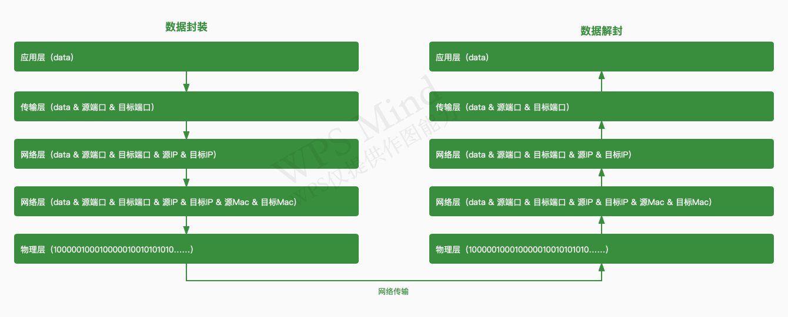
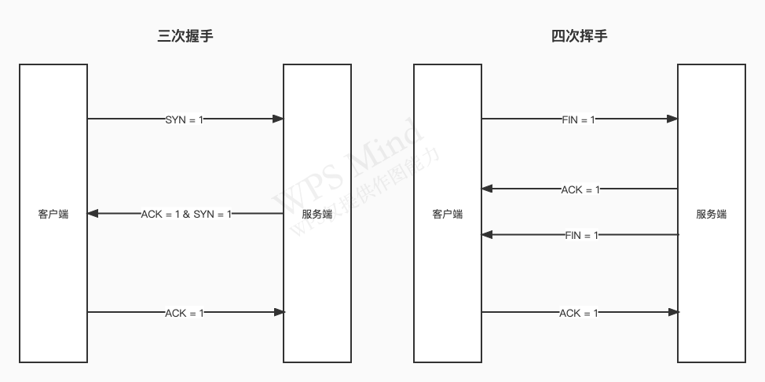

## 什么是 Node.js

Chrome 控制浏览器
Node 控制计算机

## node 应用场景和作用

### 前端工程化

- 受众群体：前端开发工程师
- 特点：提升研发效率和保证工程质量
- 具体应用：Webpack、Goulp 、客户端应用（Electron）

### 服务端渲染 SSR

- 搜索引擎优化
- 优化首屏加载速度

### 后端服务

- 受众群体：真实用户和产研，提供数据处理和接口
- 特点：并发处理，保障稳定性和安全性，真正发挥出 Node.js 的异步驱动特性

- 具体应用：SSR,BFF Server

异步驱动特性，在主线程不被 CPU 密集型所影响时，可真正发挥出 Node.js 高并发特性，可以作为大部分网络 I/O 较高的后端服务

#### 服务分类

- RESTful

- RPC

- ServerLess

#### 运行环境

- devops
- pm2
- 监控和告警机制
- 日志打印和跟踪染色

## 架构

### Natives Modules（API 层）

由 js 实现，提供了应用程序可直接调用库，例如 fs、path、http 等；

### Builtin Modules（胶水层）

主要由 c++ 代码编写而成，除了内置模块，也包含了很多第三方模块，需要 v8 引擎配合实现，相当于提供了对底层库的功能对照表；

### v8, libuv, c-ares, http parser, zlib, ... （底层）

- v8：执行 js 代码，提供桥梁接口
- libuv：事件循环、事件队列、异步 IO

## 核心特性

### 高性能体现：事件循环机制

- timers：本阶段执行已被 setTimeout()和 setInterval()调度的回调函数，由这两个函数启动的回调函数
- pending callbacks: 本阶段执行某些系统操作的回调函数
- idle、prepare：仅系统内部使用，只需要知道有这 2 个阶段就可以
- poll：检索新的 i/o 事件，执行与 i/o 相关的回调其他情况 Node.js 将在适当时在此阻塞
- check：setImmediate（）回调函数在这里执行 setImmediate 并不是立马执行而是当事件循环 poll 中没有新的事件处理时就执行该部分

### 单线程/多线程

主线程是单线程执行的，但 Node.js 存在多线程执行，多线程包括 setTimeout 和异步 i/o 事件，
其实 Node.js 还存在其他线程，包括垃圾回收、内存优化等

### 总结

- 优点：善于 网络 I/O 密集型处理，并发特性处理好
- 缺点：不善于处理 大内存和 cpu 密集型计算，例如：图片处理，大字符串，大数组处理，大文件读写

## 全局变量

### 常用全局变量

- global: 上下文对象
- \_\_filename: 返回正在执行脚本文件的绝对路径
- \_\_dirname: 返回正在执行脚本文件所在的目录
- timer 类函数: 执行顺序与事件循环间的关系
- process: 进程相关
- require: 模块加载
- module、exports: 模块导出

### process

```js
/**
 * 1. 资源
 */
// 内存使用情况
console.log(process.memoryUsage());
// cpu使用情况
console.log(process.cpuUsage());

/**
 * 2. 运行环境
 */
// 项目目录
console.log(process.cwd());
// node版本
console.log(process.version);
// node及底层lib版本
console.log(process.versions);
// cpu架构
console.log(process.arch);
// 环境字段（需要配置）
console.log(process.env.NODE_ENV);
// 本机环境变量
console.log(process.env.PATH);
// 用户环境(windows)
console.log(process.env.USERPROFILE);
// 用户环境(MacOS)
console.log(process.env.HOME);
// 系统平台
console.log(process.platform);

/**
 * 3. 运行状态
 */
// 启动参数
console.log(process.argv);
// PID
console.log(process.pid);
// 运行时间
console.log(process.uptime());
```

## NodeJS 中的模块化

### 模块化历程

- CommonJS 规范：同步加载，主要用于 nodejs 中
- AMD 规范：异步加载，为了实现在浏览器中的模块化而产生，代表库 require.js
- CMD 规范：结合了 CommonJS 规范和 AMD 规范特点而生成的一种加载方式，代表库 sea.js
- ES modules 规范：ES6 中推出的前端原生模块化规范

### CommonJS 中的 module

任意一个文件就是一个模块，可以使用 module 属性

- id: 返回模块标识符，一般是一个绝对路径
- filename: 返回文件模块的绝对路径
- loaded: 表示模块是否加载完成
- parent: 返回调用当前模块的模块对象
- children: 返回调用的其他模块的数组
- exports: 返回当前模块需要暴露的内容
- paths: 返回不同目录下 node_modules 位置的数组(加载模块时的查找策略数组)

::: warning
module.exports 和 exports 有什么区别?
exports 指向了 module.exports 的内存地址, 目的是为了方便操作.
需要注意的是, exports 不可直接使用 "=" 赋值.
:::

### CommonJS 中的 require

读入并且执行一个文件

- resolve: 返回模块文件的绝对路径
- extensions: 依据不同后缀名执行解析操作
- main: 返回模块主对象

### 模块分类及模块加载流程

模块分类

- 内置模块: Node 源码编译时写入到二进制文件中
- 文件模块: 代码运行时, 动态加载

加载流程

- 路径分析: 依据标识符确定模块位置, 标识符一般分为路径标识符和非路径标识符(常见于核心模块, 如 path, fs)
- 文件定位: 确定目标模块中具体的文件及文件类型, 查找顺序是 .js -> .json -> .node -> package.json -> main.(js/json/node) -> index.(js/json/node) -> 抛出异常
- 编译执行: 采用对应的方式完成文件的编译执行, 不同的文件编译执行方式不同, 如:
  - js 文件是读入内容之后, 进行包装生成一个可执行的函数并进行调用, 调用的时候传入 exports、module、require 等属性值
  - json 文件是将读入的内容通过 JSON.parse()进行解析

::: warning
缓存优先原则: 为了提高模块加载速度, 会优先从缓存中去读, 如果不存在, 则在模块加载完成后使用路径作为索引进行缓存
:::

## events: 事件模块(了解)

- nodejs 是基于事件驱动的异步操作架构, 内置 events 模块
- events 模块提供了 EventEmitter 类
- nodejs 中很多内置核心模块都继承自 EventEmitter 类, 比如 fs、net、http 等

### EventEmitter 常见 API

```js
const EventEmitter = require("events");

// 一般建议使用类继承EventEmitter
// class MyEmitter extends EventEmitter {}
const ev = new EventEmitter();

// on: 添加事件触发时的回调函数
ev.on("事件1", () => {
	console.log("事件1执行了 - 1");
});
ev.on("事件1", () => {
	console.log("事件1执行了 - 2");
});

const cbFn = () => {
	console.log("事件2执行了");
};
ev.on("事件2", cbFn);

ev.once("事件3", () => {
	console.log("事件3执行了");
});

// emit: 触发事件, 按照注册顺序调用
ev.emit("事件1"); // 事件1执行了 - 1 事件1执行了 - 2
ev.emit("事件2"); // 事件2执行了

// once: 添加事件首次触发的回调函数
ev.emit("事件3"); // 事件3执行了
ev.emit("事件3"); // 空

// off: 移除特定监听器
ev.off("事件2", cbFn);
```

### 浏览器中的事件环

- 执行时机: 同步任务 > 微任务 > 宏任务
- 每一个宏任务执行完毕, 都会去清空微任务队列
- 常见宏任务: setTimeout、setInterval
- 常见微任务: Promise、async await

```js
setTimeout(() => {
	console.log("s1");
	Promise.resolve().then(() => {
		console.log("p2");
	});
	Promise.resolve().then(() => {
		console.log("p3");
	});
});

Promise.resolve().then(() => {
	console.log("p1");
	setTimeout(() => {
		console.log("s2");
	});
	setTimeout(() => {
		console.log("s3");
	});
});
```

::: tip 输出结果
p1, s1, p2, p3, s2, s3
:::

### NodeJS 中的事件环

- nodejs 中的宏任务事件队列:
  1. timers: 执行 setTimeout、setInterval 回调 (常用)
  2. pending callbacks: 执行系统操作的回调, 例如 tcp udp
  3. idle, prepare: 只在系统内部进行使用
  4. poll: 执行与 I/O 相关的回调 (常用)
  5. check: 执行 setImmediate 中的回调 (常用)
  6. close callbacks: 执行 close 事件的回调
- 执行时机:
  1. 执行同步任务, 并把不同任务添加到相应的队列
  2. 执行满足条件的微任务 (nextTick > Promise)
  3. 从 timers 开始依次执行宏任务队列
  4. 每一个队列执行完后, 会去清空微任务队列, 再执行下一个宏任务队列
     ::: warning
     node11 版本之后, macro task 和 micro task 的执行时机和浏览器中相同
     :::

```js
setTimeout(() => {
	console.log("s1");
	Promise.resolve().then(() => {
		console.log("p1");
	});
	process.nextTick(() => {
		console.log("t1");
	});
});

Promise.resolve().then(() => {
	console.log("p2");
});

console.log("start");

setTimeout(() => {
	console.log("s2");
	Promise.resolve().then(() => {
		console.log("p3");
	});
	process.nextTick(() => {
		console.log("t2");
	});
});

console.log("end");
```

::: tip 输出结果
node 11 之前: start, end, p2, s1, s2, t1, p1, t2, p2<br />
node 11 之后: start, end, p2, s1, t1, p1, s2, t2, p2
:::

### NodeJS 与浏览器事件环区别

- 任务队列数不同: 浏览器只有 2 个, NodeJS 中有 6 个
- 微任务执行时机不同: nodejs 11 版本之前 是 执行完宏任务队列才去清空微任务队列, nodejs 11 之后与浏览器保持一致
- 微任务优先级不同: 浏览器中先进先出, NodeJS 中 process.nextTick 先于 promise.then 执行

::: warning setTimeout 与 setImmediate
setTimeout 第二个参数为 0 时, 可能会产生一些延时, 导致 setImmediate 先于 setTimeout 执行
:::

## 核心模块

### path

用来处理文件/目录的路径

```js
const path = require("path");
```

#### basename() 获取路径中的基础名称

```js
console.log(path.basename(__filename)); // xxx.js
console.log(path.basename(__filename, ".js")); // xxx
console.log(path.basename(__filename, ".abc")); // xxx.js
console.log(path.basename("/a/b/c")); // c
console.log(path.basename("/a/b/c/")); // c
```

#### dirname() 获取路径中目录名称

```js
console.log(path.dirname(__filename)); // /xxx/xxx/xxx
console.log(path.dirname("/a/b/c")); // /a/b
console.log(path.dirname("/a/b/c/")); // /a/b
```

#### extname() 获取路径中扩展名称

```js
console.log(path.extname(__filename)); // .js
console.log(path.extname("/a/b")); // 空
console.log(path.extname("/a/b/index.html.js.css")); // .css
console.log(path.extname("/a/b/index.html.js.")); // .
```

#### parse() 解析路径

```js
const o1 = path.parse("/a/b/c/index.html");
console.log(o1); // { root: "/", dir: "/a/b/c", base: "index.html", ext: ".html", name: "index" }

const o2 = path.parse("/a/b/c"); // path.parse("/a/b/c/")
console.log(o2); // { root: "/", dir: "/a/b", base: "c", ext: "", name: "c" }

const o3 = path.parse("./a/b/c");
console.log(o3); // { root: "/", dir: "/a/b", base: "c", ext: "", name: "c" }
```

#### format() 序列化路径

```js
const obj = path.parse("./a/b/c");
console.log(path.format(obj)); // ./a/b/c
```

#### isAbsolute() 是否为绝对路径

```js
console.log(path.isAbsolute("/foo")); // true
console.log(path.isAbsolute("///foo")); // true
console.log(path.isAbsolute("foo")); // false
console.log(path.isAbsolute("")); // false
console.log(path.isAbsolute(".")); // false
console.log(path.isAbsolute("../foo")); // false
```

#### join() 拼接路径

```js
console.log(path.join("a/b", "c", "index.html")); // a/b/c/index.html
console.log(path.join("/a/b", "c", "index.html")); // /a/b/c/index.html
console.log(path.join("/a/b", "c", "../", "index.html")); // /a/b/index.html
console.log(path.join("/a/b", "c", "./", "index.html")); // /a/b/c/index.html
console.log(path.join("/a/b", "c", "", "index.html")); // /a/b/c/index.html
console.log(path.join("")); // .
```

#### normalize() 规范化路径

```js
console.log(path.normalize("a/b/c/d")); // a/b/c/d
console.log(path.normalize("a////b/c/d")); // a/b/c/d
console.log(path.normalize("a//\\/b/c/d")); // a/b/c/d
console.log(path.normalize("a//\b/c/d")); // a/c/d
console.log(path.normalize("")); // .
```

#### resolve() 绝对路径

```js
console.log(path.resolve()); // 返回工作目录
console.log(path.resolve("a", "b")); // D:/xxx/xxx/xxx/a/b
console.log(path.resolve("index.html")); // D:/工作目录/index.html
```

### Buffer

- 全局变量，实现 NodeJS 平台下二进制文数据的操作
- 一般配合 Stream 流使用，充当数据缓冲区
- 它不占用 v8 堆内存的空间，但是内存的使用由 Node 来控制，由 v8 的 GC 来回收

#### 创建 Buffer

```js
const b1 = Buffer.alloc(6);
const b2 = Buffer.form("中"); // 可接收 字符串，数组，buffer
const b3 = b2.toString();
```

#### Buffer 的实例方法

```js
let buffer = Buffer.alloc(6);
// fill: 使用数据填充buffer（循环填充，到满为止）
buffer.fill("123");
// write: 写数据
buffer.write("123");
// toString: 提取数据
buffer.toString();
// slice: 截取buffer
buffer.slice(3, 6);
// indexOf: 查找数据位置
buffer.indexOf("2");
// copy: 拷贝数据
const to = Buffer.alloc(6);
const from = Buffer.from("中国");
from.copy(to);
```

#### Buffer 的静态方法

```js
let b1 = Buffer.form("你");
let b2 = Buffer.form("好");
// concat: 拼接多个buffer
const b = Buffer.concat([b1, b2]);
// isBuffer: 是否为buffer
console.log(b.isBuffer());
```

#### 自定义实现 Buffer 的 split 操作

```js
ArrayBuffer.prototype.split = function (sep) {
	let len = Buffer.form(sep).length;
	let ret = [];
	let start = 0;
	let offset = 0;

	while ((offset = this.indexOf(sep, start) !== -1)) {
		ret.push(this.slice(start, offset));
		start = offset + len;
	}
	set.push(this.slice(start));
	return set;
};

let buf = "我爱唱歌，爱跳舞，爱音乐，爱蹦跶爱";
let bufArr = buf.split("爱");

// ["我", "唱歌，", "跳舞，", "音乐，", "蹦跶", ""];
console.log(bufArr);
```

### fs

提供文件系统操作的 API

#### 常用 API

```js
const fs = require("fs");
const path = require("path");

// readFile: 从指定文件中读取数据
fs.readFile(path.resolve("data.txt"), "utf-8", (err, data) => {
	console.log(err);
	if (err === null) {
		console.log(data);
	}
});

// writeFile: 向指定文件写入数据
fs.writeFile("data.txt", "hello", err => {
	if (!err) {
		fs.readFile("data.txt", "utf-8", (err, data) => {
			console.log(data);
		});
	}
});

// appendFile: 追加的方式向指定文件中写入数据
fs.appendFile("data.txt", " world", err => {
	if (!err) {
		console.log("追加写入成功！");
	}
});

// copyFile: 拷贝指定文件数据到另一文件
fs.copyFile("data.txt", "copy.txt", err => {
	if (!err) {
		console.log("拷贝成功！");
	}
});

// watchFile: 对指定文件进行监控
fs.watchFile("data.txt", { interval: 20 }, (curr, prev) => {
	if (curr.mtime !== prev.mtime) {
		console.log("文件被修改了");
		// 取消监控
		fs.unwatchFile("data.txt");
	}
});
```

#### 文件打开/关闭、读/写、大文件拷贝

```js
const fs = require("fs");

// 打开
fs.open(path.resolve("data.txt"), "r", (err, fd) => {
	console.log("文件操作符：" + fd);
	// 关闭
	fs.close(fd, err => {
		!err && console.log("文件关闭成功！");
	});
});

// 读: 从文件读取数据并写入buffer中
let buf = Buffer.alloc(10);
fs.open(path.resolve("data.txt"), "r", (err, rfd) => {
	/**
	 * fd: 当前文件操作符
	 * buf: 当前缓冲区
	 * offset: 从 buf 的哪个位置开始写入
	 * length: 当前次写入长度
	 * position: 从文件的哪个位置开始读
	 * err: 错误信息
	 * readBytes: 当前次读入数据的长度
	 * data: 当前次写入的数据内容
	 */
	fs.read(rfd, buf, 0, 3, 0, (err, readBytes, data) => {});
});

// 写: 向文件写入从buffer中读到的数据
buf = Buffer.from("1234567890");
fs.open("test.txt", "w", (err, wfd) => {
	/**
	 * fd: -
	 * buf: -
	 * offset: 从 buf 的哪个位置开始读
	 * length: 当前次读入长度
	 * position: 从文件的哪个位置开始写，一般为0
	 * err: -
	 * written: 实际写入的字节数
	 * buffer: 当前缓冲区对象
	 */
	fs.write(wfd, buf, 0, 3, 0, (err, written, buffer) => {});
});
```

```js
// 大文件拷贝
const fs = require("fs");
let buf = Buffer.alloc(10);

const BUFFER_SIZE = buf.length;
const readOffet = 0;
fs.open("a.txt", "r", (err, rfd) => {
	fs.open("b.txt", "w", (err, wfd) => {
		function next() {
			fs.read(rfd, buf, 0, BUFFER_SIZE, readOffet, (err, readBytes) => {
				if (readBytes === 0) {
					// 读取完毕
					fs.close(rfd, err => {});
					fs.close(wfd, err => {});
					console.log("拷贝完成");
				}
				readOffset += readBytes;
				// readBytes: 每次读多少就写多少
				fs.write(wfd, buf, 0, readBytes, 0, (err, written) => {
					// 递归执行
					next();
				});
			});
		}
		next();
	});
});
```

#### 操作目录常用的 API

```js
const fs = require("fs");

// access: 判断文件或目录是否有操作权限(也可用来判断文件/目录是否存在)
fs.access("a.txt", err => {
	if (err) {
		console.log(err);
	} else {
		console.log("有操作权限");
	}
});

// stat: 获取文件或目录信息
fs.stat("a.txt", (err, statObj) => {
	console.log(statObj.size); // 字节数
	console.log(statObj.isFile()); // 是否文件
	console.log(statObj.isDirectory()); // 是否目录
});

// mkdir: 创建目录
fs.mkdir("a/b/c", err => {}); // 只会创建c，如果a、b不存在，报错
fs.mkdir("a/b/c", { recursive: true }, err => {}); // 递归创建

// rmdir: 删除目录
fs.rmdir("a/b", err => {}); // 只会删除b目录，如果b不为空则报错
fs.rmdir("a", { recursive: true }, err => {}); // 递归删除a及其下边所有文件和目录

// readdir: 读取目录中内容
fs.readdir("a", (err, files) => {
	console.log(files); // 返回字符串数组
});

// unlink: 删除指定文件
fs.unlink("a/a.txt", err => {
	if (!err) {
		console.log("删除成功");
	}
});
```

### stream

stream 模块是流操作的抽象接口集合，Node 中很多对象实现了这个接口。例如，对 http 服务器发起请求的 request 对象就是一个 stream，还有 stdout，fs，net，http 等。
<br />
stream 流有四种体现：

- Readable: 可读流，能够实现数据的读取
- Writeable: 可写流，能够实现数据的写操作
- Duplex: 双工流，既可读又可写
- Transform: 转换流，可读可写，还能实现数据转换

所有流都继承自 EventEmitter，常用的事件有：

- data: 当有数据可读时触发
- end: 没有更多数据可读时触发
- error: 在读/写过程中发生错误触发
- finish: 所有数据已被写入完成时触发

```js
// 使用流进行文件拷贝
const fs = require("fs");

let rs = fs.createReadStream("test.txt");
let ws = fs.createWriteStream("test-new.txt");

rs.pipe(ws);
```

#### 文件可读流创建和消费

```js
const fs = require("fs");

const rs = fs.createReadStream("test.txt", {
	flags: "r", // 打开方式
	encoding: null, // 编码格式，默认null返回Buffer
	fd: null, // 文件标识符（类似id），默认从3开始（0 1 2 被系统占用）
	mode: 438, // 权限位
	autoClose: true, // 自动关闭文件
	start: 0, // 从哪个位置开始读
	end: 3, // 读到哪个位置结束
	highWaterMark: 2 // 水位线
});

// 消费数据的两种方式：data & readable
rs.on("data", chunk => {
	console.log(chunk.toString());
	rs.pause(); // 切换到暂停状态
	setTimeout(() => {
		rs.resume(); // 切换到流动状态
	}, 1000);
});
rs.on("readable", () => {
	let chunk;
	while ((chunk = rs.read()) !== null) {
		console.log(chunk.toString());
		console.log(rs._readableState.length); // 打印缓存区剩余长度, highWaterMark控制缓存区大小
	}
});

// 常用监听事件
rs.on("open", fd => {
	console.log(fd, "文件被打开了");
});
rs.on("close", () => {
	console.log("文件关闭了");
});
rs.on("end", () => {
	console.log("文件被清空了");
});
rs.on("error", err => {
	console.log("文件出错了", err);
});

// 一般使用方式
let bufferArr = [];
rs.on("data", chunk => {
	bufferArr.push(chunk);
});
rs.on("end", () => {
	const str = Buffer.concat(bufferArr).toString();
	console.log(str);
});
```

#### 文件可写流

```js
const fs = require("fs");

const ws = fs.createWriteStream("text-new.txt", {
	flags: "w",
	mode: 438,
	fd: null,
	encoding: "utf-8",
	start: 0,
	highWaterMark: 3
});

// 写入的过程是异步操作串行执行，文件可写流只能传入 字符串 或 buffer
ws.write("写点东西", () => {
	console.log("ok1");
});
ws.write("再写点东西", () => {
	console.log("ok2");
});

// 常用事件
ws.on("open", fd => {
	console.log("文件打开了", fd);
});
ws.write("aaa");
ws.end(); // end执行之后，就代表数据写入操作完成了，触发close
ws.on("close", () => {
	console.log("文件关闭");
});
ws.write("bbb"); // 报错，走error(文件被关闭)
ws.on("error", err => {
	console.log("出错了", err);
});
```

#### 控制写入速度

```js
let fs = require("fs");

let ws = fs.createWriteStream("test.txt", { highWaterMark: 3 });
let dataSource = "控制速度".split("");
let num = 0;
let flag = true;

function executeWrite() {
	flag = true;
	while (num !== 4 && flag) {
		flag = rs.write(dataSource[num]);
		num++;
	}
}

executeWrite();
// 当写入的值达到水位线时，执行（继续生产数据）
ws.on("drain", () => {
	console.log("drain执行了");
	executeWrite();
});
```

#### 背压机制

通过把流动模式切换到暂定模式实现

```js
let fs = require("fs");

let rs = fs.createReadStream("test.txt", {
	highWaterMark: 4
});
let ws = fs.createWriteStream("test-new.txt", {
	highWaterMark: 1
});

let flag = true;
rs.on("data", chunk => {
	flag = ws.write(chunk, () => {
		console.log("写完了这一块");
	});
	if (!flag) {
		rs.pause();
	}
});
ws.on("drain", () => {
	rs.resume();
});
```

#### pipe 方法

文件读写操作的终极语法糖

```js
// 使用
const fs = require("fs");

const rs = fs.createReadStream("test.txt");
const ws = fs.createWriteStream("test-new.txt");
rs.pipe(ws);
```

```js
// 模拟实现
class MyReadStream extends EventEmitter {
	// ...此处省略文件可读流的其他内置方法

	pipe(ws) {
		this.on("data", chunk => {
			let flag = ws.write(chunk);
			if (!flag) {
				this.pause();
			}
		});
		ws.on("drain", () => {
			this.resume();
		});
	}
}
```

#### 单向链表实现 && 队列实现

文件可写流中用到了队列去存储那些需要排队写入的数据，此处做一个简单模拟实现

```js
/**
 * 节点
 * element：内容元素
 * next：指向下一个节点对象
 */
class Node {
	constructor(element, next) {
		this.element = element;
		this.next = next;
	}
}

/**
 * 单向链表
 * head：指向第一个node || null
 * size：链表长度
 */
class LinkedList {
	constructor(head, size) {
		this.head = null;
		this.size = 0;
	}
	_getNode(index) {
		if (index < 0 || index >= this.size) {
			throw new Error("下标越界");
		}
		let currentNode = this.head;
		for (let i = 0; i < index; i++) {
			currentNode = currentNode.next;
		}
		return currentNode;
	}
	add(index, element) {
		// 入参处理
		if (arguments.length === 1) {
			element = index;
			index = this.size;
		}
		// 边界处理
		if (index < 0 || index > this.size) {
			throw new Error("下标越界");
		}
		// 插入下标0的位置 && 插入中间/结尾位置
		if (index === 0) {
			let head = this.head;
			this.head = new Node(element, head);
		} else {
			let prevNode = this._getNode(index - 1);
			prevNode.next = new Node(element, prevNode.next);
		}
		this.size++;
	}
	remove(index) {
		let rmNode = null;
		if (index === 0) {
			rmNode = this.head;
			if (!rmNode) {
				return undefined;
			}
			this.head = rmNode.next;
		} else {
			let prevNode = this._getNode(index - 1);
			rmNode = prevNode.next;
			prevNode.next = rmNode.next;
		}
		this.size--;
		return rmNode;
	}
	set(index, element) {
		this._getNode(index).element = element;
	}
	get(index) {
		return this._getNode(index);
	}
	clear() {
		this.head = null;
		this.size = 0;
	}
}

/**
 * 队列（先进先出）
 * 使用LinkedList实现
 */
class Queue {
	constructor() {
		this.linkedList = new LinkedList();
	}
	enQueue(element) {
		this.linkedList.add(element);
	}
	deQueue() {
		return this.linkedList.remove(0);
	}
}

// 使用单项链表
let ll = new LinkedList();
ll.add("node1");
ll.add("node2");
ll.add(2, "node3");
// ll.remove(0);
// ll.remove(1);
// ll.set(1, "node2-change");
// console.log(ll.get(1));
// ll.clear();
console.log(ll);

// 使用队列
let queue = new Queue();
queue.enQueue("node1");
queue.enQueue("node2");
console.log(queue.deQueue());
console.log(queue.deQueue());
console.log(queue.deQueue());
```

## Node 中的网络通信

### 通信基础

#### 通信的必要条件：

- 主机之间需要有传输介质（网线、光纤、蓝牙、WiFi）并处于联通状态
- 主机上必须有网卡设备：信号的调制与解调制（二进制与高低电压互转）
- 主机之间需要协商网络速率

#### 网络通讯方式

- 交换机通讯（局域网）
  - 通过 Mac 地址来唯一标识一台主机；
  - 交换机接口数量有限；
  - 容易造成广播风暴；
- 路由器通讯（城域网、广域网、万维网、因特网、互联网）
  - Mac 地址 + IP 地址 + 其他

### 网络层次模型（OSI 七层模型和 TCP 四层模型）

#### OSI 七层模型：

- 应用层：用户与网络的接口，比如 http 协议、ftp 协议、ssh 协议等；
- 表示层：数据加密、转换、压缩；
- 会话层：控制网络连接建立和终止；
- 传输层：控制数据传输可靠性，基于端口的协议层，比如 TCP 协议、UDP 协议；
- 网络层：确定目标网络，比如 IP 协议；
- 数据链路层：确定目标主机，比如 ARP 寻址协议（寻找 MAC 地址）；
- 物理层：各种物理设备和标准；

#### TCP 四层模型：

- 应用层：七层模型中合并前三层（应用层 + 表示层 + 会话层）
- 传输层：不变
- 主机层：网络层改名得来
- 接入层：数据链路层 + 物理层

### 数据封装与解封

<br/>

<br/>

### TCP 三次握手和四次挥手

常见控制字段

- SYN = 1：表示请求建立连接
- FIN = 1：表示请求断开连接
- ACK = 1：表示数据信息确认

<br/>

<br/>

### 创建 TCP 通信

```js
/**
 * 服务端
 */
const net = require("net");

// 创建服务端实例
const server = net.createServer();

const PORT = 1234;
const HOST = "localhost";

server.listen(PORT, HOST);

server.on("listening", () => {
	console.log(`服务端开启在${HOST}:${PORT}`);
});

server.on("connection", socket => {
	socket.on("data", chunk => {
		const msg = chunk.toString();
		console.log(msg);
		// 回数据
		socket.write(`你好，${msg}`);
	});
});

server.on("close", () => {
	console.log("服务端关闭了");
});

server.on("error", err => {
	if (err.code == "EADDRINUSE") {
		console.log("地址已经被使用");
	} else {
		console.log(err);
	}
});
```

```js
/**
 * 创建客户端
 */
const net = require("net");

const client = net.createConnection({
	host: "127.0.0.1",
	prot: 1234
});

client.on("connct", () => {
	client.write("客户端");
});

// 粘包模拟
// client.on("connct", () => {
// 	client.write("客户端1");
// 	client.write("客户端2");
// 	client.write("客户端3");
// 	client.write("客户端4");
// });

// 粘包解决：弊端 - 降低了数据的传输效率
// let dataArr = ["客户端1", "客户端2", "客户端3", "客户端4"];
// client.on("connct", () => {
// 	for (let i = 0; i < dataArr.length; i++) {
// 		(function (val, index) {
// 			setTimeout(() => {
// 				client.write(val);
// 			}, 1000 * index);
// 		})(dataArr[i], i);
// 	}
// });

client.on("data", chunk => {
	console.log(chunk.toString());
});

client.on("error", err => {
	console.log(err);
});

client.on("close", () => {
	console.log("客户端断开连接");
});
```

### 数据粘包：使用封包拆包解决

```js
/**
 * 自定义编码解码类
 */
class MyTransform {
	constructor() {
		// 规定当前header总长度为4个字节
		this.packageHeaderLen = 4;
		// 当前包的编号
		this.serialNum = 0;
		// header总共4个字节，需要存储"当前编号"和"想要获取的消息体长度"，拆分后为2
		this.serialLen = 2;
	}

	// 编码: writeInt16BE - 从指定位置写入一个有效的带符号的16位整数
	encode(data, serialNum) {
		const body = Buffer.form(data);
		// 为header申请空间
		const headerBuf = Buffer.alloc(this.packageHeaderLen);
		// 写入头部信息
		headerBuf.writeInt16BE(serialNum || this.serialNum);
		headerBuf.writeInt16BE(body.length, this.serialLen);
		// 保证每一个数据包都有一个单独的编号使用
		if (serialNum === undefined) {
			this.serialNum++;
		}
		return Buffer.concat([headerBuf, body]);
	}

	// 解码
	decode(buffer) {
		const headerBuf = buffer.slice(0, this.packageHeaderLen);
		const bodyBuf = buffer.slice(this.packageHeaderLen);

		// readInt16BE：从指定位置开始读取一个有效的带符号的16位整数
		return {
			serialNum: headerBuf.readInt16BE(),
			bodyLength: headerBuf.readInt16BE(this.serialLen),
			body: bodyBuf.toString()
		};
	}

	// 获取包长度
	getPackageLen(buffer) {
		if (buffer.length < this.packageHeaderLen) {
			return 0;
		} else {
			return this.packageHeaderLen + buffer.readInt16BE(this.serialLen);
		}
	}
}

module.exports = MyTransform;
```

```js
/**
 * 服务端
 */
const net = require("net");
const MyTransform = require("./MyTransform");

const server = net.createServer();
const mt = new MyTransform();
// 存放剩余的buffer
let overageBuffer = null;
server.listen(1234, "localhost");
server.on("listening", () => {
	console.log("服务器运行在 localhost:1234");
});
server.on("connection", socket => {
	socket.on("data", chunk => {
		if (overageBuffer) {
			chunk = Buffer.concat(overageBuffer, chunk);
		}
		let packageLen = 0;
		while ((packageLen = mt.getPackageLen(chunk))) {
			const packageCon = chunk.slice(0, packageLen);
			chunk = chunk.slice(packageLen);

			const ret = mt.decode(packageCon);
			socket.write(mt.encode(ret.body, ret.serialNum));
		}
		overageBuffer = chunk;
	});
});
```

```js
/**
 * 客户端
 */
const net = require("net");
const MyTransform = require("./MyTransform");

const mt = new MyTransform();
const client = net.createConnection({
	host: "localhost",
	prot: 1234
});
client.write(mt.encode("消息01"));
client.write(mt.encode("消息02"));
client.write(mt.encode("消息03"));
client.write(mt.encode("消息04"));
client.write(mt.encode("消息05"));
client.on("data", chunk => {
	if (overageBuffer) {
		chunk = Buffer.concat(overageBuffer, chunk);
	}
	let packageLen = 0;
	while ((packageLen = mt.getPackageLen(chunk))) {
		const packageCon = chunk.slice(0, packageLen);
		chunk = chunk.slice(packageLen);

		const ret = mt.decode(packageCon);
		socket.write(mt.encode(ret.body, ret.serialNum));
	}
	overageBuffer = chunk;
});
```

### 创建 HTTP 通信

```js
const http = require("http");
// 帮助处理url路径相关
const url = require("url");

const server = http.createServer((req, res) => {
	// 请求路径
	console.log(req.url);

	// 处理过的url: 第二个参数表示格式化输出
	const { pathname, query } = url.parse(req.url, true);
	console.log(pathname);
	console.log(query);

	// 请求方式
	console.log(req.method);

	// 版本号
	console.log(req.httpVersion);

	// 请求头
	console.log(req.headers);

	// 获取请求体的数据
	const bodyArr = [];
	req.on("data", data => {
		arr.push(data);
	});
	req.on("end", () => {
		console.log(Buffer.concat(bodyArr).toString());
	});

	// 给客户端回写数据：end()代表写入结束
	// res.write("data");
	// res.end();

	// 等效于
	res.end("data");

	// 设置响应状态码，默认200
	res.statusCode = 302;
	// 设置响应头
	res.setHeaders("Content-type", "text/html;charset=utf-8");
	// 写入中文
	res.end("你好啊");
});
server.listen(1234, () => {
	console.log("server is start ...");
});
```
