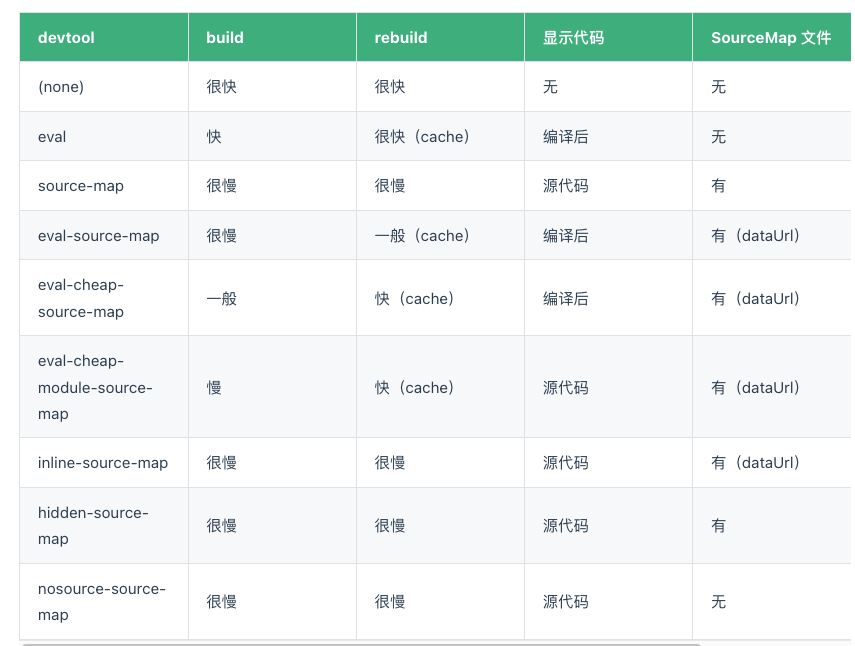

## 分析工具

### 增加编译进度条

[progress-bar-webpack-plugin](https://www.npmjs.com/package/progress-bar-webpack-plugin)

```js
const chalk = require('chalk')
const ProgressBarPlugin = require('progress-bar-webpack-plugin')
module.exports = {
  plugins: [
    // 进度条
    new ProgressBarPlugin({
        format: `  :msg [:bar] ${chalk.green.bold(':percent')} (:elapsed s)`
      })
  ],
}
```

### 编译速度分析

[speed-measure-webpack-plugin](https://www.npmjs.com/package/speed-measure-webpack-plugin)

```js
const SpeedMeasurePlugin = require("speed-measure-webpack-plugin");
const smp = new SpeedMeasurePlugin();
module.exports = smp.wrap({
  // ...webpack config...
})

```

### 打包体积分析

[webpack-bundle-analyzer](https://www.npmjs.com/package/webpack-bundle-analyzer)

```js
const BundleAnalyzerPlugin = require('webpack-bundle-analyzer').BundleAnalyzerPlugin;
module.exports = {
  plugins: [
    // 打包体积分析
    new BundleAnalyzerPlugin()
  ],
}

```

## 加快打包速度

### 缩小范围

- exclude/include
    - include：符合条件的模块进行解析
    - exclude：排除符合条件的模块，不解析
    - exclude 优先级更高

- 优化resolve/alias

- 减少loader、plugins插件

- 使用asset module 代替旧的 assets loader

- externals/cdn方式引用额外库

- noParse

```js
const config = {
  //...
  module: { 
    noParse: /jquery|lodash/,
    rules:[...]
  }
};


```

- IgnorePlugin

防止在 import 或 require 调用时，生成以下正则表达式匹配的模块
    - requestRegExp 匹配(test)资源请求路径的正则表达式。
    - contextRegExp 匹配(test)资源上下文（目录）的正则表达式。

### 利用缓存

- babel-loader 开启缓存

```js
const config = {
 module: { 
    noParse: /jquery|lodash/,
    rules: [
      {
        test: /\.js$/i,
        include: resolve('src'),
        exclude: /node_modules/,
        use: [
          // ...
          {
            loader: 'babel-loader',
            options: {
              cacheDirectory: true // 启用缓存
            }
          },
        ]
      },
      // ...
    ]
  }
}
```

- cache-loader 就可以帮我们完成这件事情

```js
const config = {
 module: { 
    // ...
    rules: [
      {
        test: /\.(s[ac]|c)ss$/i, //匹配所有的 sass/scss/css 文件
        use: [
          // 'style-loader',
          MiniCssExtractPlugin.loader,
          'cache-loader', // 获取前面 loader 转换的结果
          'css-loader',
          'postcss-loader',
          'sass-loader', 
        ]
      }, 
      // ...
    ]
  }
}

```

- cache 持久化缓存

```js
const config = {
  cache: {
    type: 'filesystem',
  },
};

```

- hard-source-webpack-plugin(webpack5已内置)

### 编译提速

- DllPlugin 预编译

- 使用 Esbuild（go）esbuild-loader 替换 babel-loader 、ts-loader

```js
module.exports = {
    resolve: {
        extensions: ['.tsx', '.ts', '.js'],
    },4
    module: {
        rules: [
            {
                test: /\.(js|ts|jsx|tsx)$/,
                include: paths.appSrc,
                use: [
                  {
                    loader: 'esbuild-loader',
                    options: {
                      loader: 'tsx',
                      target: 'es2015',
                    },
                  }
                ]
              },
         ]
     }
 }

```

SWC（rust）

### 利用多核

- thread-loader
- happyPack(弃用)

### sourceMap 的选用

<br/>

<br/>

- 本地开发：

    - 推荐：eval-cheap-module-source-map
    - 理由：
    本地开发首次打包慢点没关系，因为 eval 缓存的原因，rebuild 会很快
    开发中，我们每行代码不会写的太长，只需要定位到行就行，所以加上 cheap
    我们希望能够找到源代码的错误，而不是打包后的，所以需要加上 module

- 生产环境：

    - 推荐：(none)
    - 理由：
    就是不想别人看到我的源代码


## 减小打包体积

### 压缩

- terser-webpack-plugin(webpack5自带)

```js
//本文配置的parallel数量为4，使用多进程并发运行压缩以提高构建速度；
const TerserPlugin = require('terser-webpack-plugin');
module.exports = {
    optimization: {
        minimizer: [
            new TerserPlugin({
              parallel: 4,
              terserOptions: {
                parse: {
                  ecma: 8,
                },
                compress: {
                  ecma: 5,
                  warnings: false,
                  comparisons: false,
                  inline: 2,
                },
                mangle: {
                  safari10: true,
                },
                output: {
                  ecma: 5,
                  comments: false,
                  ascii_only: true,
                },
              },
            }),
        ]
    }
}
```

- css-minimizer-webpack-plugin

```js
const CssMinimizerPlugin = require("css-minimizer-webpack-plugin");

module.exports = {
  optimization: {
    minimizer: [
      new CssMinimizerPlugin({
          parallel: 4,
        }),
    ],
  }
}
```

- 图片压缩（image-webpack-loader）

- gzip/brotli


### 剃除无用代码

- JS TreeShaking 摇树
    - Dead Code 一般具有以下几个特征：​
        - 代码不会被执行，不可到达
        - 代码执行的结果不会被用到
        - 代码只会影响死变量（只写不读）

- CSS Tree Shaking (purgecss-webpack-plugin)

- 推荐阅读[从过去到现在，聊聊 Tree-shaking](https://mp.weixin.qq.com/s/TNXO2ifPymaTxIqzBAmkSQ)

```js
const glob = require('glob')
const MiniCssExtractPlugin = require('mini-css-extract-plugin')
const PurgeCSSPlugin = require('purgecss-webpack-plugin')
const paths = require('paths')

module.exports = {
  plugins: [
    // 打包体积分析
    new BundleAnalyzerPlugin(),
    // 提取 CSS
    new MiniCssExtractPlugin({
      filename: "[name].css",
    }),
    // CSS Tree Shaking
    new PurgeCSSPlugin({
      paths: glob.sync(`${paths.appSrc}/**/*`,  { nodir: true }),
    }),
  ]
}

```

### 代码分割

- splitChunks

```js
module.exports = {
  optimization: {
    splitChunks: {
      // include all types of chunks
      chunks: 'all',
      // 重复打包问题
      cacheGroups:{
        // node_modules里的代码
        // 第三方模块
        vendors:{
          test: /[\\/]node_modules[\\/]/,
          chunks: "all",
          // name: 'vendors', 一定不要定义固定的name
          priority: 10, // 优先级
          enforce: true 
        },
        // 公共的模块
      	common: {
          name: 'common', // chunk 名称
          priority: 0, // 优先级
          minSize: 0,  // 公共模块的大小限制
          minChunks: 2  // 公共模块最少复用过几次
       	}
      }
    }
  }
}
```

- CSS文件分离 mini-css-extract-plugin

```js
const MiniCssExtractPlugin = require("mini-css-extract-plugin");

module.exports = {
  plugins: [new MiniCssExtractPlugin()],
  module: {
    rules: [
        {
        test: /\.module\.(scss|sass)$/,
        include: paths.appSrc,
        use: [
          'style-loader',
          isEnvProduction && MiniCssExtractPlugin.loader, // 仅生产环境
          {
            loader: 'css-loader',
            options: {
              modules: true,
              importLoaders: 2,
            },
          },
          {
            loader: 'postcss-loader',
            options: {
              postcssOptions: {
                plugins: [
                  [
                    'postcss-preset-env',
                  ],
                ],
              },
            },
          },
          {
            loader: 'thread-loader',
            options: {
              workerParallelJobs: 2
            }
          },
          'sass-loader',
        ].filter(Boolean),
      },
    ]
  },
};

```

- 路由/代码懒加载


### 更小的图片体积

- webp
- avif
- 更合适的尺寸: 当页面仅需显示 100px/100px 大小图片时，对图片进行压缩到 100px/100px
- 更合适的压缩: 可对前端图片进行适当压缩，如通过 sharp 等
- 雪碧图

## 参考

- [[性能优化] 使用 esbuild 为你的构建提速 🚀](https://juejin.cn/post/7068210964599930887#heading-2)

- [从过去到现在，聊聊 Tree-shaking](https://mp.weixin.qq.com/s/TNXO2ifPymaTxIqzBAmkSQ)


