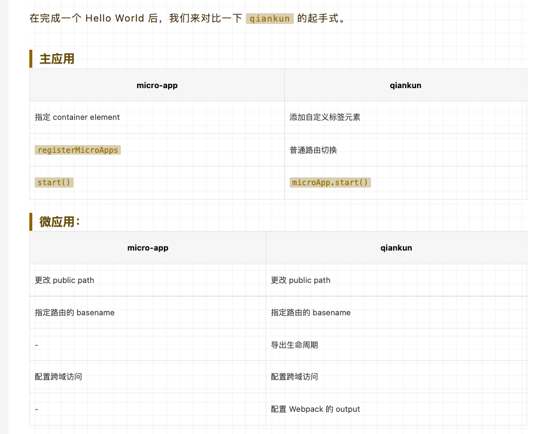

## 特性

### 没有沿袭single-spa的思路

micro-app并没有沿袭single-spa的思路，而是借鉴了WebComponent的思想，通过CustomElement结合自定义的ShadowDom，将微前端封装成一个类WebComponent组件，从而实现微前端的组件化渲染。并且由于自定义ShadowDom的隔离特性，micro-app不需要像single-spa和qiankun一样要求子应用修改渲染逻辑并暴露出方法，也不需要修改webpack配置，是目前市面上接入微前端成本最低的方案。

### 借鉴了WebComponent的思想

过CustomElement结合自定义的ShadowDom，将微前端封装成一个类WebComponent组件，从而实现微前端的组件化渲染。并且由于自定义ShadowDom的隔离特性

### 成本低

micro-app不需要像single-spa和qiankun一样要求子应用修改渲染逻辑并暴露出方法，也不需要修改webpack配置，是目前市面上接入微前端成本最低的方案

## 优势

1. 使用简单

我们将所有功能都封装到一个类WebComponent组件中，从而实现在基座应用中嵌入一行代码即可渲染一个微前端应用。

同时micro-app还提供了js沙箱、样式隔离、元素隔离、预加载、数据通信、静态资源补全等一系列完善的功能。

2. 零依赖

micro-app没有任何依赖，这赋予它小巧的体积和更高的扩展性。

3. 兼容所有框架

为了保证各个业务之间独立开发、独立部署的能力，micro-app做了诸多兼容，在任何技术框架中都可以正常运行。

micro-app兼容所有框架以及脚手架构建工具包括Vite、Nextjs、Nuxtjs。

## 与qiankun的对比

 

 

## 原理

micro-app将所有功能都封装到一个类WebComponent组件中，从而实现在基座应用中嵌入一行代码即可渲染一个微前端应用。 同时micro-app还提供了js沙箱、样式隔离、元素隔离、预加载、数据通信、静态资源补全、插件系统一系列完善的功能。

MicroApp 的核心功能在CustomElement基础上进行构建，CustomElement用于创建自定义标签，并提供了元素的渲染、卸载、属性修改等钩子函数，我们通过钩子函数获知微应用的渲染时机，并将自定义标签作为容器，微应用的所有元素和样式作用域都无法逃离容器边界，从而形成一个封闭的环境。

## WebComponent基本概念

WebComponent就是利用官方提供的原生API实现类似Vue、React的组件形式，它由三项主要技术组成，它们可以一起使用来创建封装功能的定制元素，可以在你喜欢的任何地方重用，不必担心代码冲突。

- Custom elements（自定义元素）： 一组JavaScript API，允许您定义custom elements及其行为，然后可以在您的用户界面中按照需要使用它们。
- Shadow DOM（影子DOM） ：一组JavaScript API，用于将封装的“影子”DOM树附加到元素（与主文档DOM分开呈现）并控制其关联的功能。通过这种方式，您可以保持元素的功能私有，这样它们就可以被脚本化和样式化，而不用担心与文档的其他部分发生冲突。
- HTML templates（HTML模板）：  **<'template'>** 和 **<'slot'>** 元素使您可以编写不在呈现页面中显示的标记模板。然后它们可以作为自定义元素结构的基础被多次重用。

[秒懂 Web Component](https://juejin.cn/post/7063258471180795917)

## 参考

- [秒懂 Web Component](https://juejin.cn/post/7063258471180795917)

- [micro-app官网](https://cangdu.org/micro-app/docs.html#/)
- [初探 MicroApp，一个极致简洁的微前端框架](https://juejin.cn/post/7058112712076689439)
